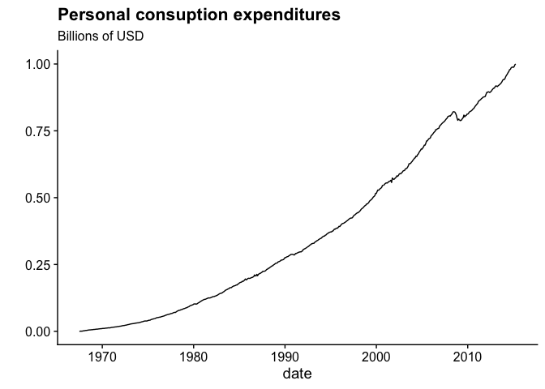

```r
library(tidyverse)
```

```
## ── Attaching packages ─────────────────────────────────────── tidyverse 1.3.1 ──
```

```
## ✓ ggplot2 3.3.5     ✓ purrr   0.3.4
## ✓ tibble  3.1.6     ✓ dplyr   1.0.8
## ✓ tidyr   1.2.0     ✓ stringr 1.4.0
## ✓ readr   2.1.2     ✓ forcats 0.5.1
```

```
## ── Conflicts ────────────────────────────────────────── tidyverse_conflicts() ──
## x dplyr::filter() masks stats::filter()
## x dplyr::lag()    masks stats::lag()
```

```r
library(cowplot)

econ <- economics_long 

econ %>% 
  filter(variable == 'pce') %>% 
  ggplot(aes(x = date, y = value01)) +
  geom_line() + 
  ylab('') +
  ggtitle('Personal consuption expenditures',
          subtitle = 'Billions of USD') +
  cowplot::theme_cowplot()
```

<!-- -->

